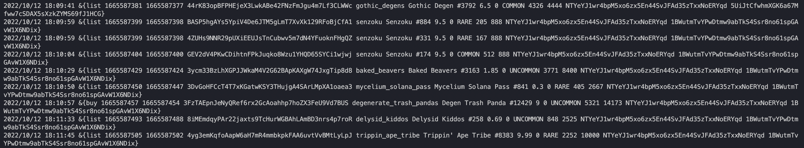
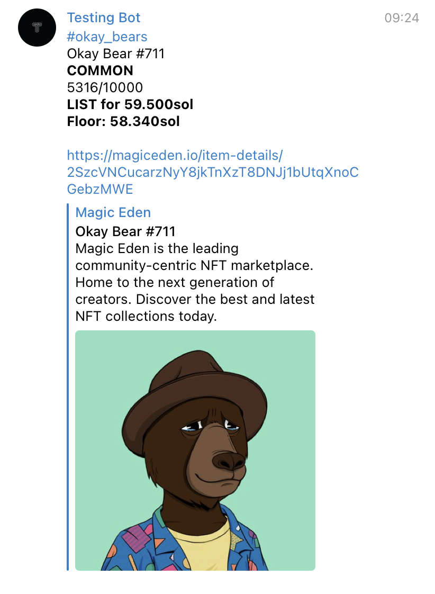

# me-sniper

me-sniper is an on-chain MagicEden sniper that detects all new listings on MagicEden throw blockchain with telegram notifications feature. autobuy is possible with MagicEden API Key. 

## Installation

1. Clone repository.
    ```bash
    git clone https://github.com/fidesy/me-sniper.git
     ```
2. Fill in config file with the following variables:

    ```bash
    solana-endpoint: <YOUR_SOLANA_RPC_ENDPOINT>
    bot-api-key: <YOUR_TELEGRAM_APIKEY>
    me-api-key: <YOUR_MAGIC_EDEN_APIKEY>
    private-key: <YOUR_SOLANA_WALLET_PRIVATE_KEY>
    ```
    
    If you don't need telegram notification then just skip second variable.

    ME_APIKEY and PRIVATE_KEY variables are only needed if you want to automatically buy NFTs, otherwise jusk skip them.
    
    [Add autobuy conditions here](https://github.com/fidesy/me-sniper/blob/main/pkg/sniper/sniper.go#L99)

    You can get Solana RPC node for free at https://www.quicknode.com
3. Run script
    ```bash
    go run cmd/me-sniper/main.go
    ```
4. (Optional) If you are using telegram bot, then write /start command to it.
## Usage

### Logs contain:

* Action type (now only list/buy)
* Block/Current timestamp
* collection symbol, token name
* price, rarity, rank, supply, seller, buyer




### Telegram notifications.



## License
[MIT](https://choosealicense.com/licenses/mit/)